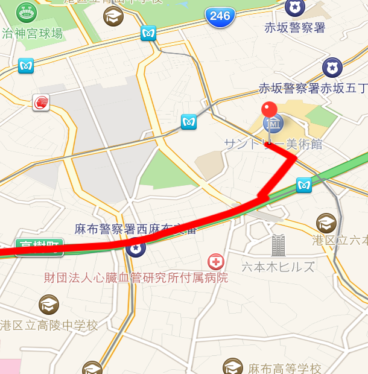

# SwiftMapKitTest

This is iOS MapKit Sample Project in Swift Language.

## Usage
git clone git@github.com:oggata/SwiftMapKitTest.git

## ToDo's

- add text box and input deperture & destination.
- Suggestions, issues and pull requests are more than welcome.

## Document
Qiita
http://qiita.com/oggata/items/18ce281d5818269c7281

## Contact

Fumitoshi Ogata
- [twitter.com/oggata](http://twitter.com/oggata)
- oggata@gmail.com

## License
SwiftMapKitTest is available under the MIT license. 
See the LICENSE file for more info.
